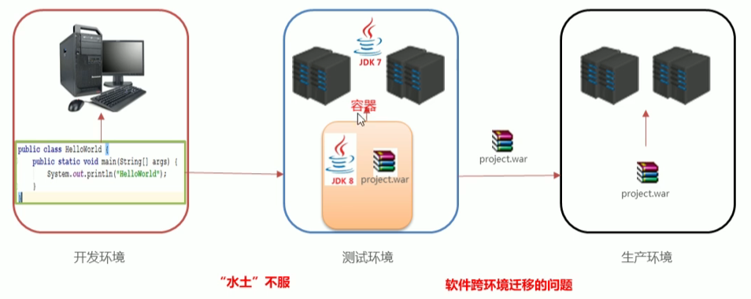
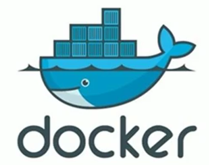
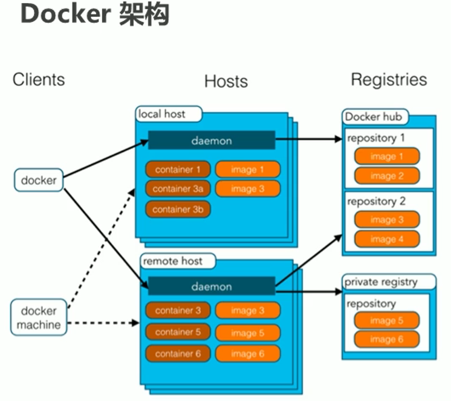

# 1 Docker概述

## 1.1 Docker概念

开发中不同环境下的**软件跨环境迁移**问题：

> 代码“水土不服”



Docker概念：



- Docker是一个开源的**应用容器引擎**
- 诞生于2013年初，基于Go语言实现，dotCloud公司出品（后改名Docker Inc）
- Docker可以让开发者打包他们的**应用**以及**依赖包**到一个**轻量级、可移植的容器**中，然后发布到任何流行的Linux机器上
- 容器是完全使用沙箱机制，**相互隔离**
- 容器**性能开销极低**

> ==**Docker**是一种容器技术，解决软件跨环境迁移的问题==

## 1.2 安装Docker

Docker可以运行在在MAC、Windows、CentOS、[UBUNTU](https://so.csdn.net/so/search?q=UBUNTU&spm=1001.2101.3001.7020)等操作系统上

 官网：https://www.docker.com

1.  yum包更新到最新

   ```
   yum update
   ```

2. 安装需要的软件包，yum-util 提供yum-config-manager功能，另外两个是devicemapper驱动依赖的

   ```
   yum install -y yum-utils device-mapper-persistent-data lvm2
   ```

3. 设置yum源

   ```
   yum-config-manager --add-repo https://download.docker.com/linux/centos/docker-ce.repo
   ```

4. 安装docker，出现输入的界面都按 y

   ```
   yum install -y docker-ce
   ```

5. 查看docker版本，验证是否成功

   ```
   docker -v
   ```

## 1.3 Docker架构



> 注：
>
> - 这里的本机local host指的就是虚拟机CentOS
> - **image**和**container**的关系就像**类**和**对象**的关系
> - **Docker hub**和**private registry**就像Maven**中央仓库**和**私服**那样

- 镜像（Image）：Docker镜像（Image），就相当于是一个**root文件系统**。比如官方镜像 ubuntu:16.04就包含了完整的一套Ubuntu16.04最小系统的root文件系统

  > 就是安装一个**容器系统**需要的东西

- 容器（Container）：镜像（Image）和容器（Container）的关系，就像是面向对象程序设计中的类和**对象**一样，镜像是静态的定义，容器是镜像运行时的实体。容器可以被创建、启动、停止、删除、暂停等

- 仓库（Repository）：仓库可以看成一个**代码控制中心**，用来保存镜像

## 1.4 配置Docker镜像加速器

默认情况下，将从docker hub（https://hub.docker.com/）上下载docker镜像，太慢。一般都会配置镜像加速器

USTC：中科大镜像加速器（https://docker.mirrors.ustc.edu.cn）
阿里云
网易云
腾讯云

 在这里我们用阿里云镜像加速器，**登陆阿里云**，进入**控制台**，搜索**容器镜像服务**，找到**镜像加速器**，得到**个人加速地址**

 注意：用阿里云时，每个人加速器地址不同，然后在终端输入下面指令

```c
sudo mkdir -p /etc/docker
sudo tee /etc/docker/daemon.json <<-'EOF'
{
  "registry-mirrors": ["https://zteks7pj.mirror.aliyuncs.com"]
}
EOF
sudo systemctl daemon-reload
sudo systemctl restart docker
```

# 2 Docker命令

## 2.1 Docker服务相关命令

启动docker 服务：`systemctl start docker`

停止docker 服务：`systemctl stop docker`

重启docker 服务：`systemctl restart docker`

查看docker 服务状态：`systemctl status docker`

设置开机启动docker：`systemctl enable docker`

禁止开机启动docker：`systemctl disable docker`

## 2.2 Docker镜像相关命令

查看镜像：查看本地所有的镜像

```sh
docker images
docker images -q #查看所有镜像的id
```

搜索镜像：从网络中查找需要的镜像

```c
docker search 镜像名称
```

拉取镜像：从Docker 仓库下载镜像到本地，**镜像名称**格式为`名称:版本号`，如果版本号不指定则是最新的版本。如果不知道**镜像版本**，可以去www.hub.docker.com搜索对应镜像查看

```c
docker pull 镜像名称
```

删除镜像：删除本地镜像

```sh
docker rmi 镜像id|名称号:版本号 #删除指定本地镜像
docker rmi `docker images -q` #删除所有本地镜像
```

> rmi：remove image；
>
> 镜像id通过`docker images`命令查看；
>
> 删除所有本地镜像的命令，其实是将``里面命令的**执行结果当成参数**

## 2.3 Docker容器相关命令

查看容器

```sh
docker ps #查看正在运行的容器
docker ps -a #查看所有容器
```

创建并启动容器

```dockerfile
docker run 参数 版本:版本号 <进入容器的初始化指令>
```

- 参数说明：

  - `-i`：保持容器运行。通常与`-t`同时使用。

    - 加入`it`这两个参数后，容器创建后**自动进入容器**中，退出容器后，容器**自动关闭**

      > 自动关闭是因为没有`-d`

  - `-t`：为容器重新分配一个伪输入**终端**，通常与`-i`同时使用

  - `-d`：以守护（后台）模式运行容器。创建一个容器在**后台运行**。

    - 需要使用`docker exec`进入容器：
      `docker exec -it 容器名 初始化命令`
    - 退出后，**容器仍然不会关闭**

  - `-it`创建的容器一般称为**交互式容器**；`-id`创建的容器一般称为**守护式容器**

  - `--name`：为创建的容器**命名**

- 进入容器的初始化指令

  - centOS镜像默认为`/bin/bash`
  - 如果不是创建后自动进入容器，可以不指定该指令

  


