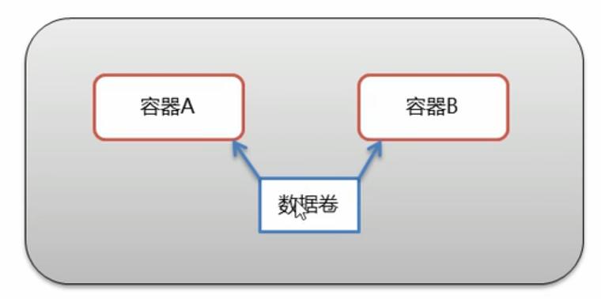

# 1 Docker概述

## 1.1 Docker概念

开发中不同环境下的**软件跨环境迁移**问题：

> 代码“水土不服”


Docker概念：


- Docker是一个开源的**应用容器引擎**
- 诞生于2013年初，基于Go语言实现，dotCloud公司出品（后改名Docker Inc）
- Docker可以让开发者打包他们的**应用**以及**依赖包**到一个**轻量级、可移植的容器**中，然后发布到任何流行的Linux机器上
- 容器是完全使用沙箱机制，**相互隔离**
- 容器**性能开销极低**

> ==**Docker**是一种容器技术，解决软件跨环境迁移的问题==

## 1.2 安装Docker

Docker可以运行在在MAC、Windows、CentOS、[UBUNTU](https://so.csdn.net/so/search?q=UBUNTU&spm=1001.2101.3001.7020)等操作系统上

 官网：https://www.docker.com

1.  yum包更新到最新

   ```
   yum update
   ```

2. 安装需要的软件包，yum-util 提供yum-config-manager功能，另外两个是devicemapper驱动依赖的

   ```
   yum install -y yum-utils device-mapper-persistent-data lvm2
   ```

3. 设置yum源

   ```
   yum-config-manager --add-repo https://download.docker.com/linux/centos/docker-ce.repo
   ```

4. 安装docker，出现输入的界面都按 y

   ```
   yum install -y docker-ce
   ```

5. 查看docker版本，验证是否成功

   ```
   docker -v
   ```

## 1.3 Docker架构


> 注：
>
> - 这里的本机local host指的就是虚拟机CentOS
> - **image**和**container**的关系就像**类**和**对象**的关系
> - **Docker hub**和**private registry**就像Maven**中央仓库**和**私服**那样

- 镜像（Image）：Docker镜像（Image），就相当于是一个**root文件系统**。比如官方镜像 ubuntu:16.04就包含了完整的一套Ubuntu16.04最小系统的root文件系统

  > 就是安装一个**容器系统**需要的东西

- 容器（Container）：镜像（Image）和容器（Container）的关系，就像是面向对象程序设计中的类和**对象**一样，镜像是静态的定义，容器是镜像运行时的实体。容器可以被创建、启动、停止、删除、暂停等

- 仓库（Repository）：仓库可以看成一个**代码控制中心**，用来保存镜像

## 1.4 配置Docker镜像加速器

默认情况下，将从docker hub（https://hub.docker.com/）上下载docker镜像，太慢。一般都会配置镜像加速器

USTC：中科大镜像加速器（https://docker.mirrors.ustc.edu.cn）
阿里云
网易云
腾讯云

 在这里我们用阿里云镜像加速器，**登陆阿里云**，进入**控制台**，搜索**容器镜像服务**，找到**镜像加速器**，得到**个人加速地址**

 注意：用阿里云时，每个人加速器地址不同，然后在终端输入下面指令

```c
sudo mkdir -p /etc/docker
sudo tee /etc/docker/daemon.json <<-'EOF'
{
  "registry-mirrors": ["https://zteks7pj.mirror.aliyuncs.com"]
}
EOF
sudo systemctl daemon-reload
sudo systemctl restart docker
```

# 2 Docker命令

## 2.1 Docker服务相关命令

启动docker 服务：`systemctl start docker`

停止docker 服务：`systemctl stop docker`

重启docker 服务：`systemctl restart docker`

查看docker 服务状态：`systemctl status docker`

设置开机启动docker：`systemctl enable docker`

禁止开机启动docker：`systemctl disable docker`

## 2.2 Docker镜像相关命令

查看镜像：查看本地所有的镜像

```sh
docker images
docker images -q #查看所有镜像的id
```

搜索镜像：从网络中查找需要的镜像

```c
docker search 镜像名称
```

拉取镜像：从Docker 仓库下载镜像到本地，**镜像名称**格式为`名称:版本号`，如果版本号不指定则是最新的版本。如果不知道**镜像版本**，可以去www.hub.docker.com搜索对应镜像查看

```c
docker pull 镜像名称
```

删除镜像：删除本地镜像

```sh
docker rmi 镜像id|名称号:版本号 #删除指定本地镜像
docker rmi `docker images -q` #删除所有本地镜像
```

> rmi：remove image；
>
> 镜像id通过`docker images`命令查看；
>
> 删除所有本地镜像的命令，其实是将``里面命令的**执行结果当成参数**

查看镜像详细信息

```sh
docker inspect 镜像名:版本号
```

## 2.3 Docker容器相关命令

查看容器

```sh
docker ps #查看正在运行的容器
docker ps -a #查看所有容器
```

创建并启动容器

```dockerfile
docker run 参数 版本:版本号 <进入容器的初始化指令>
```

- 参数说明：

  - `-i`：保持容器运行。通常与`-t`同时使用。

    - 加入`it`这两个参数后，容器创建后**自动进入容器**中，退出容器后，容器**自动关闭**

      > 自动关闭是因为没有`-d`

  - `-t`：为容器重新分配一个伪输入**终端**，通常与`-i`同时使用

  - `-d`：以守护（后台）模式运行容器。创建一个容器在**后台运行**。

    - 需要使用`docker exec`进入容器：
      `docker exec -it 容器名 初始化命令`
    - 退出后，**容器仍然不会关闭**

  - `-it`创建的容器一般称为**交互式容器**；`-id`创建的容器一般称为**守护式容器**

  - `--name`：为创建的容器**命名**

  - 后面还会讲解其他参数

- 进入容器的初始化指令

  - centOS镜像默认为`/bin/bash`
  - 如果不是创建后自动进入容器，可以不指定该指令


进入容器

```sh
docker exec -it 容器名 初始化命令
```

停止容器

```sh
docker stop 容器名称
```

启动容器

```sh
docker start 容器名称
```

删除容器：如果容器是**运行状态**则删除失败，需要停止容器参能删除

```sh
docker rm 容器名称
```

> 删除所有容器：
>
> ```sh
> docker rm `docker ps -ap`
> ```

查看容器详细信息

```sh
docker inspect 容器名称
```

# 3 Docker容器的数据卷

## 3.1 数据卷的概念及作用

### 3.1.1 数据卷概念

<u>思考</u>：

- Docker容器删除后，在容器中产生的数据还在吗？

  - 不在了，容器都没了，其中的数据也消失了
  - 这样很不安全

  

- Docker容器和外部机器可以直接交换文件吗？

  - 不可以
  - 但宿主机和外部机器确实可以

  

- 容器之间想要进行数据交互？

  

> 要解决以上问题，就需要用到**数据卷**

**<u>数据卷</u>**：

- 数据卷是**宿主机**中的一个**目录或文件**

  > 当然，需要一个**挂载**操作
  >
  > 
  >
  > 这样，上面的三个问题就解决了

  > 容器**数据的持久化**

- 当容器目录和数据卷目录绑定后，对方的修改会立即同步

- 一个数据卷可以被多个容器同时挂载

  

- 一个容器可以被挂载多个数据卷

### 3.1.2 数据卷作用

- 容器数据持久化
- 外部机器和容器间接通信
- 容器之间数据交换

## 3.2 配置数据卷

创建启动容器时，使用`-v 参数`设置数据卷：

```sh
docker run ... -v 宿主机目录(或文件):容器内目录(文件) ...
```

- 冒号两边不能有空格

- 目录必须是绝对路径

- 如果目录不存在，会自动创建

- 可以挂载多个数据卷

  > 多写几个`-v 参数`就行，当然最好别都往一个目录下挂载，比较乱
  >
  > > 貌似这样也不允许？没试过

## 3.3 配置数据卷容器

<u>思考</u>：

- 多容器进行数据交换问题

  - 刚刚就讲过一种方式了，多个容器挂载同一个数据卷即可

    - 但这种方式操作比较麻烦

  - 还有第二种方式，就是**数据卷容器**

    

    > 这样就算删除c3容器，c1和c2也会保持挂载状态 

<u>配置</u>：

1. 创建并启动一个容器，使用`-v 容器中的目录`设置数据卷

   - 举例：`docker run -it --name=c3 -v /volume centos:7 /bin/bash`

     > `volume`不是固定的名字，可以改的

   - docker会自动在宿主机中分配一个目录当作数据卷

     > 可以使用`docker inspect 容器名`查看分配到的目录，找到`Mounts`即可

2. 创建并启动容器，使用`--volumes-from 参数`设置数据卷容器

   - 举例：
     `docker run -it --name=c1 --volumes-from c3 centos:7 /bin/bash`
     `docker run -it --name=c2 --volumes-from c3 centos:7 /bin/bash`

> 数据卷小结：
>
> - 数据卷概念
>   - 宿主机的一个目录或文件
> - 数据卷作用
>   - 容器数据持久化
>   - 客户端和容器数据交换
>   - 容器之间数据交换
> - 数据卷容器
>   - 创建一个容器，挂载一个目录，让其他容器继承自该容器（`--volume-from`）
>   - 通过简单方式实现数据卷配置

# 4 Docker应用部署

## 4.1 MySQL部署

案例：需求

- 在Docker容器中部署MySQL，并通过外部mysql客户端操作MySQL Server

案例：实现步骤

1. 搜索mysql镜像
2. 拉取mysql镜像
3. 创建容器
4. 操作容器中的mysql

问题：外部机器怎么访问容器中的MySQL服务？

- 容器内的网络服务和外部机器不能直接通信

- 外部机器和宿主机可以直接通信

- 宿主机和容器可以直接通信

- 当容器中的网络服务需要被外部机器访问时，可以将**容器中提供服务的端口**映射到宿主机的端口上。外部机器访问宿主机的该端口，从而间接访问容器中的服务

  

- 这种操作称为：**端口映射**

  > 类似数据卷的思想

  - 相关命令见下面的操作步骤

具体操作步骤：

1. 搜索mysql镜像

   ```sh
   docker search mysql
   ```

2. 拉取mysql镜像

   ```sh
   docker pull mysql:5.6
   ```

3. 创建容器，设置端口映射、目录映射

   ```sh
   # 在/root目录下创建mysql目录用于存储mysql数据信息
   mkdir ~/mysql
   cd ~/mysql
   ```

   ```sh
   docker run -id \
   -p 3307:3306 \
   --name=c_mysql \
   -v $PWD/conf:/etc/mysql/conf.d \
   -v $PWD/logs:/logs \
   -v $PWD/data:/var/lib/mysql \
   -e MYSQL_ROOT_PASSWORD=123456 \
   mysql:5.6
   ```

   - 参数说明：

     - `-p 3307:3306`：将容器的3306端口映射到宿主机的3307端口

       > 当然，一般情况下，都是映射到**相同的端口号**下

     - 三个`-v $PWD/...`：挂载**配置目录、日志目录和数据目录**

       > 环境变量`$PWD$`在这个场景下就相当于`/root/mysql`
       >
       > > 因为前面已经`cd ~/mysql`了

     - `-e MYSQL_ROOT_PASSWORD=123456`：初始化root用户的密码

       > `e`：`env`
       >
       > `MYSQL_ROOT_PASSWORD`是MySQL的环境变量

4. 这样进入容器之后可以通过终端操作， 也可以通过宿主机客户端（比如sqlyog）访问

## 4.2 Tomcat部署

案例：需求

- 在Docker容器中部署Tomcat，并通过外部机器访问Tomcat部署的项目

案例：实现步骤

1. 搜索tomcat镜像
2. 拉取tomcat镜像
3. 创建容器
4. 部署项目
5. 测试访问

具体操作步骤：

1. 搜索tomcat镜像

   ```sh
   docker search tomcat
   ```

2. 拉取tomcat镜像

   ```sh
   docker pull tomcat
   ```

3. 创建容器，设置端口映射、目录映射

   ```sh
   #在/root目录下创建tomcat目录用于存储tomcat数据信息
   mkdir ~/tomcat
   cd tomcat
   ```

   ```sh
   docker run -id --name=c_tomcat \
   -p 8080:8080 \
   -v $PWD:/usr/local/tomcat/webapps \
   tomcat
   ```

4. 在tomcat文件夹下创建项目，就可以访问了

   > 没有默认页面，需要自己创建一个项目文件夹，然后里面给个`index.html`

## 4.3 Nginx部署

案例：需求

- 在Docker容器中部署Nginx，并通过外部机器访问Nginx

案例：实现步骤

1. 搜索Nginx镜像
2. 拉取Nginx镜像
3. 创建容器
4. 测试访问

具体操作步骤：

1. 搜索nginx镜像

   ```sh
   docker search nginx
   ```

2. 拉取nginx镜像

   ```sh
   docker pull nginx
   ```

3. 创建容器，设置端口映射、目录映射

   ```sh
   #在/root目录下创建nginx目录用于存储nginx数据信息
   mkdir ~/nginx
   cd ~/nginx
   mkdir conf
   cd conf
   # 在~/nginx/conf下创建nginx.conf文件，粘贴下面内容
   vim nginx.conf
   ```

   ```nginx
   user nginx;
   worker_processes 1;
   
   error_log 	/var/log/nginx/error.log warn;
   pid 		/var/run/nginx.pid;
   
   events {
       worker_connections 1024;
   }
   
   http {
       include			/etc/nginx/mime.types;
       default_type 	application/octet-stream;
       
       log_format main	'$remote_addr - $remote_user [$time_local] "$request" '
           			'$status $body_bytes_sent "$http_referer" '
           			'"$http_user_agent" "$http_x_forwarded_for"';
       
       access_log		/var/log/nginx/access.log	main;
       
       sendfile 		on;
       #tcp_nopush		on;
       
       keepalive_timeout	65;
       
       #gzip	on;
       
       include			/etc/nginx/conf.d/*.conf;
   }
   ```

   ```shell
   cd .. # 要先回到nginx目录
   docker run -id --name=c_nginx \
   -p 80:80 \
   -v $PWD/conf/nginx.conf:/etc/nginx/nginx.conf \
   -v $PWD/logs:/var/log/nginx \
   -v $PWD/html:/usr/share/nginx/html \
   nginx
   ```

   - 参数说明
     - 注意这里有一个文件映射，`$PWD/conf/nginx.conf`要提前准备好
     - html目录就是存放资源的目录

4. 在html目录中创建`index.html`文件，就可以使用外部机访问nginx了（默认端口就是80）

## 4.4 Redis部署

案例：需求

- 在Docker容器中部署Redis，并通过外部机器访问Redis

案例：实现步骤

1. 搜索Redis镜像
2. 拉取Redis镜像
3. 创建容器
4. 测试访问

具体操作步骤：

1. 搜索Redis镜像

   ```sh
   docker search redis
   ```

2. 拉取Redis镜像

   ```sh
   docker pull redis:5.0
   ```

3. 创建容器，设置端口映射

   ```sh
   docker run -id --name=c_redis -p 6379:6379 redis:5.0
   ```

4. 使用外部机器连接redis

   ```sh
   redis-cli.exe -h hadoop200 -p 6379
   ```

   > 可以直接用windows的redis客户端

# 5 Dockerfile

## 5.1 Docker镜像原理

思考：

- Docker镜像本质是什么？
  - 一个文件，但不是普通的文件
- Docker中一个centos镜像为什么只有200MB，而一个centos操作系统的iso文件要几个G？
- Docker中一个tomcat镜像为什么有500MB，而一个tomcat安装包只有70多MB？


### 5.1.1 镜像与操作系统

> 镜像和操作系统息息相关，通过镜像文件也可以安装并启动一个“操作系统”

操作系统组成部分：

- 进程调度子系统
- 进程通信子系统
- 内存管理子系统
- 设备管理子系统
- **文件管理子系统**
- 网络通信子系统
- 作业控制子系统

Linux文件系统由bootfs和rootfs两部分组成

> fs：file system
>
> 

- bootfs：包含bootloader（引导加载程序）和kernel（内核）

- rootfs：root文件系统，包含的就是典型Linux系统中的/dev，/proc，/bin，/etc等标准目录和文件

  > rootfs是要基于bootfs开发的

- 不同的linux发行版，bootfs基本一样，而rootfs不同，如ubuntu、centos等

### 5.1.2 镜像与文件系统

- Docker镜像是由特殊的**文件系统叠加**而成

  > 一个重要的好处就是：**复用**

- 最底端是bootfs，并使用宿主机的bootfs

  > 也就是说docker和宿主机用一个内核，做到了**复用**，不用再加载一遍，所以**启动非常快**
  >
  > > 进一步说，在Linux的系统上就不能安装windows的docker

- 第二层是root文件系统rootfs，称为***base image***，也是一种镜像

- 然后再往上可以**叠加**其他的镜像文件

  > 有的镜像需要依赖其他镜像，比如tomcat镜像，需要jdk镜像，也需要rootfs基础镜像，但对外暴露的是一个tomcat镜像
  >
  > > 下载tomcat镜像的时候，就要看有没有jdk镜像，没有就要下载，再接着看rootfs，没有也要下载，一层一层叠加。当然，对外统一暴露的还是一个tomcat镜像整体。
  > >
  > > 下载的时候也能看到，是好几层同时在下
  >
  > 
  >
  > > 注意这是**只读镜像**，下面也会进一步讲解
  >
  > 这也解释了为什么tomcat镜像大于一个单独的安装包；

  > 这样做的好处是，在之后下载其他镜像时，其他镜像可以**复用**已经下载好的处于底层位置的镜像，不需要再下载一遍

- **统一文件系统**（Union File System）技术能够将不同的层整合成一个文件系统，为这些层提供了一个统一的视角，这样就隐藏了多层的存在，在用户的角度看来，只存在一个文件系统

- 一个镜像可以放在另一个镜像上面，位于下面的镜像称为**父镜像**，最底部的镜像称为**基础镜像**

- 当从一个镜像启动容器时，Docker会在最顶层加载一个**读写文件系统**作为容器

  > 之前不是只读镜像吗，不能改，因为改了没法更方便地复用了。
  >
  > 
  >
  > 如果非要改，那就要先用镜像**启动容器**，然后**在新的文件系统下修改**，修改后，再将容器弄成一个新的镜像
  >
  > 
  >
  > 这样做，想改的都改了，**新的镜像**有了，之前底层的镜像还能照常**复用**

回答思考题：

- Docker镜像本质是什么？

  - **分层文件系统**

- Docker中一个centos镜像为什么只有200MB，而一个centos操作系统的iso文件要几个G？

  - centos的iso镜像文件包含bootfs和rootfs，而docker的centos镜像复用操作系统的bootfs，只有rootfs和其他镜像层

- Docker中一个tomcat镜像为什么有500MB，而一个tomcat安装包只有70多MB？

  - 由于docker中镜像是分层的，tomcat虽然只有70多MB，但它需要依赖于**父镜像和基础镜像**，所以整个对外暴露的tomcat镜像大小有500多MB

    > 使用`docker inspect tomcat:latest`查看一下：
    >
    > 
    >
    > 有好多层

## 5.2 镜像制作

Docker镜像如何制作？

- 容器转为镜像

  ```sh
  docker commit 容器id 镜像名称:版本号
  ```

  ```sh
  docker save -o 压缩文件名称 镜像名称:版本号 # 将镜像打包成压缩包
  ```

  > 这样做的目的就是，**修改镜像配置并将其保存**。
  >
  > 比如可以直接在tomcat容器中部署一个程序，然后将容器整体打包成镜像，之后直接运行镜像文件，就不用再部署了

  ```sh
  docker load -i 压缩文件名称 # 将压缩包还原成镜像
  ```

  

  > 问题：通过commit提交镜像时，数据卷中的数据不生效怎么办？再挂载回去即可

## 5.2 Dockerfile概念及作用

### 5.2.1 Dockerfile概念

Dockerfile是一个文本文件

包含了一条条的指令

每一条指令构建一层，基于基础镜像，最终构建出一个新的镜像

对于开发人员：可以为开发团队提供一个完全一致的开发环境

对于测试人员：可以直接拿开发时所构建的镜像或者通过Dockerfile文件构建一个新的镜像开始工作了

对于运维人员：在部署时，可实现应用的无缝移植


## 5.3 Dockerfile关键字

<table><thead><tr><th>关键字</th><th>作用</th><th align="left">备注</th></tr></thead><tbody><tr><td>FROM</td><td>指定父镜像</td><td align="left">指定dockerfile基于哪个images构建</td></tr><tr><td>MAINTAINER</td><td>作者信息</td><td align="left">用来标明这个dockerfile 谁写的</td></tr><tr><td>LABEL</td><td>标签</td><td align="left">用来指明dockerfile 的标签，可以使用Label代替Maintainer 最终都是在docker image基本信息中可以查看</td></tr><tr><td>RUN</td><td>执行命令</td><td align="left">执行一段命令 默认是<code>/bin/sh</code> 格式：<code>RUN command</code> 或者 <code>RUN ["command","param1","param2"]</code></td></tr><tr><td>CMD</td><td>容器启动命令</td><td align="left">提供启动容器时候的默认命令和ENTRYPOINT配合使用。格式：<code>CMD command param1 param2</code>或者<code>CMD ["command","param1","param2"]</code></td></tr><tr><td>ENTRYPOINT</td><td>入口</td><td align="left">一般在制作一些执行就关闭的容器中会使用</td></tr><tr><td>COPY</td><td>复制文件</td><td align="left">build 的时候复制文件到image中</td></tr><tr><td>ADD</td><td>添加文件</td><td align="left">build 的时候添加文件到iamge 中，不仅仅局限于当前build 上下文 可以来源于远程服务</td></tr><tr><td>ENV</td><td>环境变量</td><td align="left">指定build 时候的环境变量 可以在启动容器的时候 通过<code>-e</code>覆盖 格式：<code>ENV name = value</code></td></tr><tr><td>ARG</td><td>构建参数</td><td align="left">构建参数 只在构建的时候使用参时 如果有ENV 那么ENV 的相同名字的值始终覆盖ARG 的值</td></tr><tr><td>VOLUME</td><td>定义外部可以挂载的数据卷</td><td align="left">指定build 的image 那些目录可以启动的时候挂载到文件系统中 启动容器的时候使用<code>-v</code>绑定 格式：<code>VOLUME ["目录"]</code></td></tr><tr><td>EXPOSE</td><td>暴露端口</td><td align="left">定义容器运行的时候监听的端口 启动容器的使用<code>-p</code>来绑定暴露端口 格式：<code>EXPOSE 8080</code>或者<code>EXPOSE 8080/udp</code></td></tr><tr><td>WORKDIR</td><td>工作目录</td><td align="left">指定容器内部的工作目录 如果没有创建则自动创建 如果指定/使用是绝对地址 如果不是/开头那么是在上一条workdir 的路径的相对路径</td></tr><tr><td>USER</td><td>指定执行用户</td><td align="left">指定build 或者启动的时候 用户 在RUN CMD ENTRYPOINT执行的时候的用户</td></tr><tr><td>HEALTHCHECK</td><td>健康检查</td><td align="left">指定监测当前容器的健康测试的命令 基本上没用 因为很多时候 应用本身由健康监测机制</td></tr><tr><td>ONBUILD</td><td>触发器</td><td align="left">当存在ONBUILD 关键字的镜像作为基础镜像的时候 当执行FROM 完成之后 会执行ONBUILD的命令 但是不影响当前镜像 用处也不怎么大</td></tr><tr><td>STOPSIGNAL</td><td>发送信息量到宿主机</td><td align="left">该STOPSIGNAL指令设置将发送到容器的系统调用信号以退出</td></tr><tr><td>SHELL</td><td>指定执行脚本的shell</td><td align="left">指定RUN CMD ENTRYPOINT 执行命令的时候 使用的shell</td></tr></tbody></table>

## 5.4 案例

案例：需求

- 定义dockerfile，发布springboot项目

案例：实现步骤

- 定义父镜像：`FROM java:8`

- 定义作者信息：`MAINTANIER username<useremail>`

- 将jar包添加到容器：`ADD springboot.jar app.jar`

- 定义容器启动执行的命令：`CMD java -jar app.jar`

  > 后面又写一个`app.jar`，是改名

- 通过dockerfile构建镜像：`docker build -f dockerfile文件路径 -t 镜像名称:版本 .`

```sh
docker build -f image_manager.dockerfile -t image_manager .
```

```sh
docker stop image_manager_container
docker rm image_manager_container
docker run -id -p 8089:8089 -v /home/ices/docker-files/rocksdb/defaultCF:/rocksdb/defaultCF -v /var/run/docker.sock:/var/run/docker.sock -v /usr/bin/docker:/usr/bin/docker --name=image_manager_container image_manager

```

```sh
docker exec -it image_manager_container /bin/bash
```


