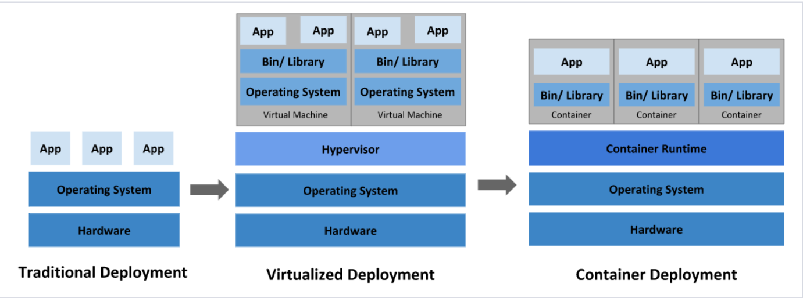
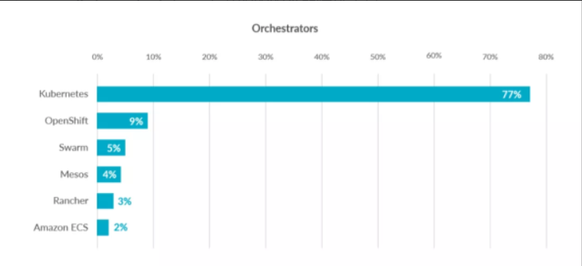
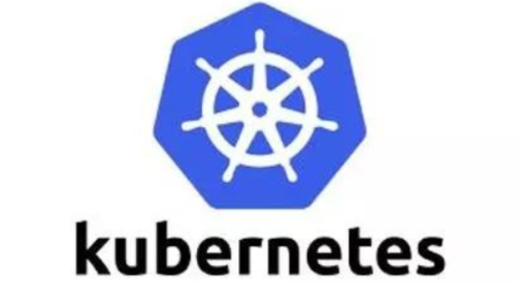
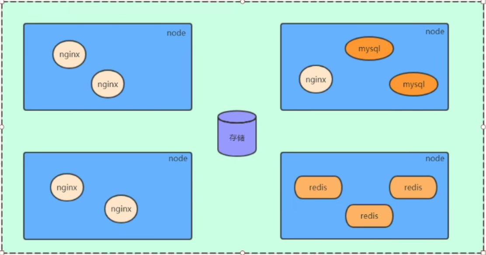
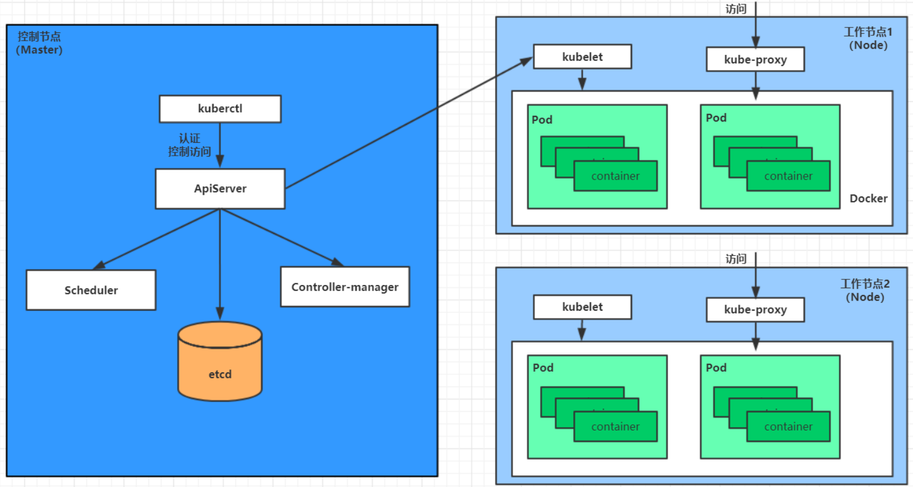
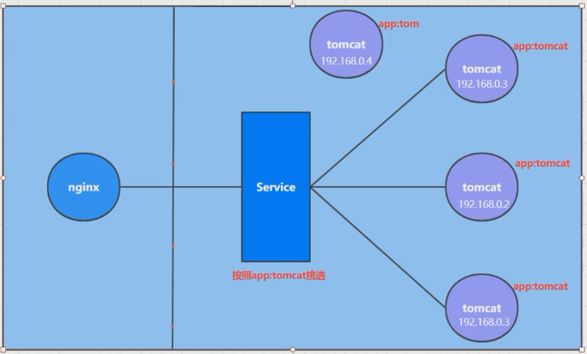
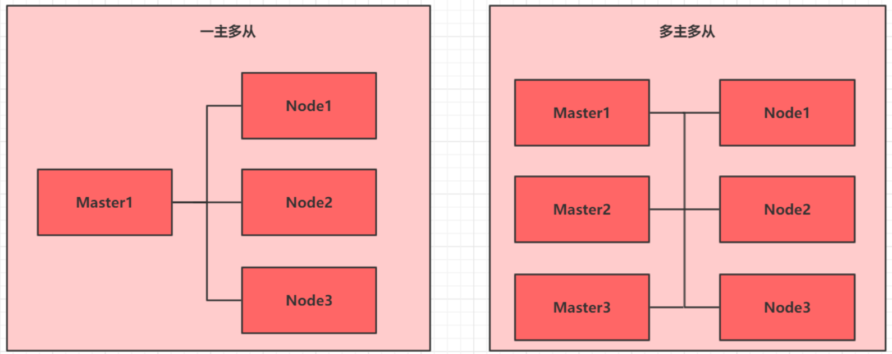

# 1 kubernetes介绍

## 1.1 应用部署方式演变

<u>在部署应用程序的方式上，主要经历了三个时代</u>：

- **传统部署**：互联网早期，会直接将应用程序部署在物理机上

  - 优点：简单，不需要其它技术的参与

  - 缺点：不能为应用程序定义资源使用边界，很难合理地**分配计算资源**，而且程序之间容易产生影响

    >程序之间容易产生影响的意思：
    >
    >比如一个程序内存泄露了，可能会影响到其他使用同一内存的程序；
    >
    >而一台机器只部署一个程序又有点浪费资源

- **虚拟化部署**：可以在一台物理机上运行多个**虚拟机**，每个虚拟机都是独立的一个环境

  - 优点：程序环境不会相互产生影响，提供了一定程度的安全性

  - 缺点：增加了操作系统，浪费了部分资源

    > 浪费了部分资源的意思：
    >
    > 本身有操作系统，现在还要自己再虚拟一个操作系统，每个完整的操作系统又都有自己的库，又要占用资源，有时候会不够**轻量级**

- **容器化部署**：与虚拟化类似，但是**共享了操作系统**

  - 优点：

    - 可以保证每个容器拥有自己的文件系统、CPU、内存、进程空间等

      > 需要的外界环境都是完整的、独立的

    - 运行应用程序所需要的资源都被容器包装，并**和底层基础架构解耦**

      > 资源都是容器提供的，不需要操作系统去特殊管理

    - 容器化的应用程序可以**跨云服务商、跨Linux操作系统发行版**进行部署

<u>容器化部署方式给带来很多的便利，但是也会出现一些问题，比如说</u>：

- 一个容器**故障**停机了，怎么样让另外一个容器立刻启动去替补停机的容器
- 当**并发**访问量变大的时候，怎么样做到横向扩展容器数量

<u>这些容器管理的问题统称为**容器编排**问题，为了解决这些容器编排问题，就产生了一些容器编排的软件</u>：

- **Docker Swarm**：Docker自己的容器编排工具
- **Apache Mesos**：Apache的一个资源统一管控的工具，需要和Marathon结合使用
- **Google Kubernetes**：Google开源的的容器编排工具

> kubernetes的容器编排市场占有率是很高的；OpenShift和Rancher也是对kubernetes的封装

## 1.2 kubernetes简介

kubernetes，是一个全新的基于容器技术的分布式架构领先方案，是谷歌严格保密十几年的秘密武器——Borg系统的一个开源版本，于2014年9月发布第一个版本，2015年7月发布第一个正式版本。

kubernetes的本质是**一组服务器集群**，它可以在集群的每个**节点**上运行特定的程序，来对**节点中的容器**进行管理。目的是实现资源管理的自动化，主要提供了如下的主要功能：

> 特定的程序是什么呢？每个节点上的都一样吗？特定的程序怎么工作的？这些问题会在接下来解答

- **自我修复**：一旦某一个容器崩溃，能够在1秒中左右迅速启动新的容器

- **弹性伸缩**：可以根据需要，自动对集群中正在运行的**容器数量**进行调整

- **服务发现**：服务可以通过自动发现的形式找到它所依赖的服务

  > 比如nginx需要mysql和redis的帮助，就会在内部自动寻找对应的容器与服务

- **负载均衡**：如果一个服务起动了多个容器，能够自动实现请求的负载均衡

  > 负载均衡也有很多种策略，比如轮询

- **版本回退**：如果发现新发布的程序版本有问题，可以立即回退到原来的版本

- **存储编排**：可以根据容器自身的需求自动创建存储卷

> 其中的node可以表示一个服务器

## 1.3 kubernetes组件

一个kubernetes集群主要是由**控制节点(master)**、**工作节点(node)**构成，每种节点上都会安装**不同的组件**。

**master：集群的控制平面，负责集群的决策 ( 管理 )**

> **ApiServer** : 资源操作的唯一入口，接收用户输入的命令，提供认证、授权、API注册和发现等机制
>
> **Scheduler** : 负责集群资源调度，按照预定的调度策略将Pod调度到相应的node节点上
>
> > **计算**一下怎么更好地调度各个节点，进行相应工作
>
> **ControllerManager** : 负责维护集群的状态，比如程序部署安排、故障检测、自动扩展、滚动更新等
>
> > 真正去**安排调度**工作的
>
> **Etcd** ：负责存储集群中各种资源对象的信息
>
> > 比如工作安排完了，要记录一下谁在负责这个工作

**node (节点) ：集群的数据平面，负责为容器提供运行环境 ( 干活 )**

> **Kubelet** : 负责维护容器的生命周期，即通过控制docker，来创建、更新、销毁容器
>
> > 接活的，然后进一步下达命令的
>
> **KubeProxy** : 负责提供集群内部的服务发现和**负载均衡**
>
> > 访问容器中程序的入口。注意，ApiServer是资源操作/控制的入口，而KubeProxy是访问程序的入口
>
> **Docker** : 负责节点上容器的各种操作

下面，以部署一个nginx服务来说明kubernetes系统各个组件调用关系：

1. 首先要明确，一旦kubernetes环境启动之后，**master**和**node**都会将自身的信息存储到**etcd**数据库中

2. 一个nginx服务的安装**请求**会首先被发送到master节点的apiServer组件

3. apiServer组件会调用scheduler组件来决定到底应该把这个服务安装到哪个node节点上

   在此时，它会从**etcd**中读取各个node节点的信息，然后按照一定的**算法**进行选择，并将结果告知apiServer

4. apiServer调用controller-manager去调度Node节点安装nginx服务

5. kubelet接收到指令后，会通知docker，然后由docker来启动一个nginx的pod

   pod是kubernetes的最小操作单元，容器必须跑在pod中至此，

6. 一个nginx服务就运行了，如果需要访问nginx，就需要通过kube-proxy来对pod产生访问的代理

这样，外界用户就可以访问集群中的nginx服务了

## 1.4 kubernetes概念

**Master**：集群控制节点，每个集群需要**至少一个master节点**负责集群的管控

**Node (节点)** ：工作负载节点，由master分配容器到这些node工作节点上，然后node节点上的docker负责容器的运行

**Pod (吊舱)** ：kubernetes的**最小控制单元**，容器都是运行在pod中的，一个pod中可以有1个或者多个容器

**Controller**：控制器，通过它来实现**对pod的管理**，比如启动pod、停止pod、伸缩pod的数量等等

**Service**：pod对外服务的统一入口，下面可以维护者同一类的多个pod

**Label**：标签，用于对pod进行分类，同一类pod会拥有相同的标签

**NameSpace**：命名空间，用来隔离 pod (吊舱) 的运行环境

> 紫色的就是pod，Service是服务访问入口，可以用来负载均衡；
>
> 会发现有一个pod没有和图中的Service相连，这其实是由Label机制进行管理的，红色的就代表标签

# 2 集群环境搭建

## 2.1 环境规划

### 2.1.1 集群类型

Kubernetes集群大致分为两类：一主多从和多主多从。

- 一主多从：**一个Master节点**和多台Node节点，搭建简单，但是有**单机故障风险**，适合用于**测试环境**。
- 多主多从：多台Master和多台Node节点，搭建麻烦，安全性高，适合用于生产环境。

> 说明：为了测试方便，本次搭建的是一主两从类型的集群。

### 2.1.2 安装方式

kubernetes有多种部署方式，目前主流的方式有kubeadm、minikube、二进制包

- minikube：一个用于快速搭建单节点的kubernetes工具。
- kubeadm：一个用于快速搭建kubernetes集群的工具。
- 二进制包：从官网上下载每个组件的二进制包，依次去安装，此方式对于理解kubernetes组件更加有效。

> 说明：现在需要安装kubernetes的集群环境，但是又不想过于麻烦，所以选择kubeadm方式。

### 2.1.3 主机规划

| 作用   | IP地址          | 操作系统               | 配置                    |
| ------ | --------------- | ---------------------- | ----------------------- |
| Master | 192.168.109.100 | CentOS7 基础设施服务器 | 2核CPU，2G内存，50G硬盘 |
| Node1  | 192.168.109.101 | CentOS7 基础设施服务器 | 2核CPU，2G内存，50G硬盘 |
| Node2  | 192.168.109.102 | CentOS7 基础设施服务器 | 2核CPU，2G内存，50G硬盘 |

## 2.2 环境搭建

本次环境搭建需要三台CentOS服务器（一主二从），然后在每台服务器中分别安装Docker（18.06.3）、kubeadm（1.17.4）、kubectl（1.17.4）和kubelet（1.17.4）。

### 2.2.1 主机安装

### 2.2.3 环境初始化

### 2.2.4 安装docker

### 2.2.5 安装kubernetes组件

### 2.2.6 准备集群镜像

### 2.2.7 集群初始化

### 2.2.8 安装网络插件

# 3 资源管理

# 4 实战入门

# 5 Pod详解

# 6 Pod控制器详解

# 7 Service详解

# 8 数据存储

# 9 安全认证

# 10 DashBoard